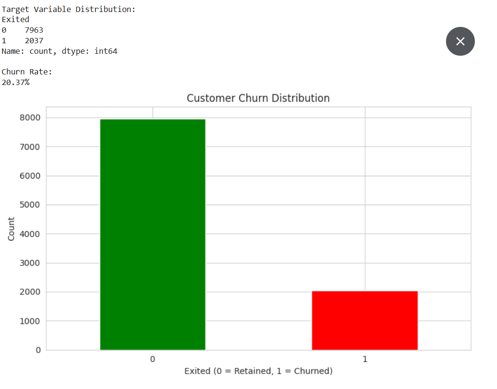
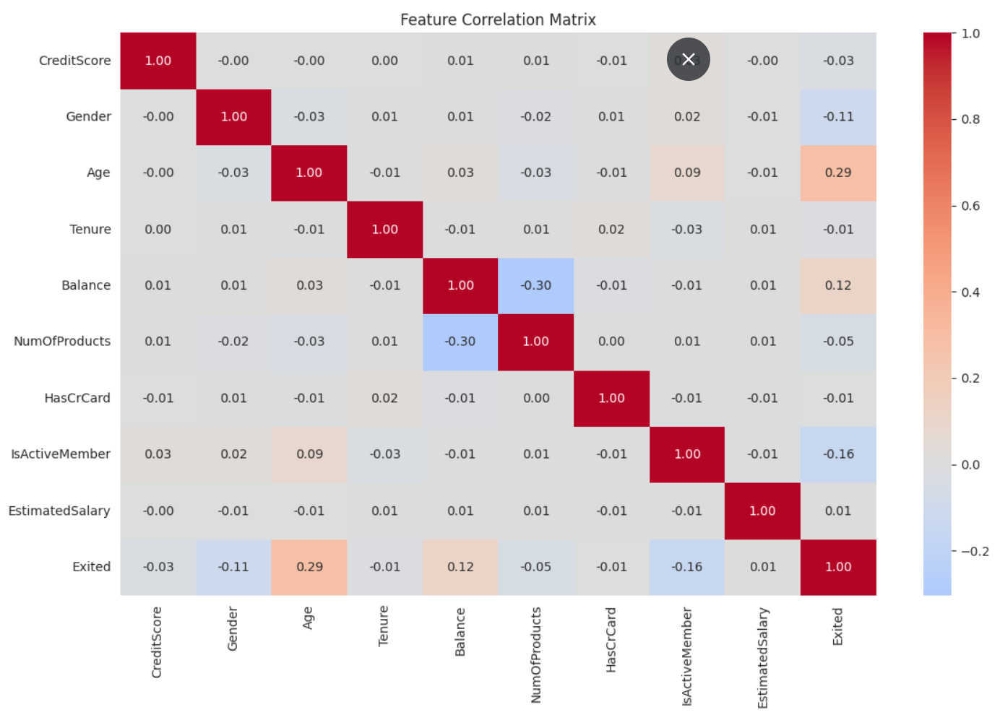
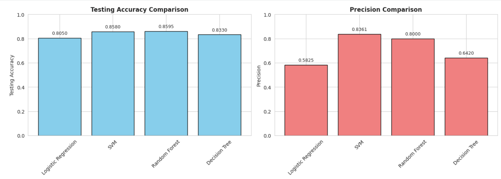
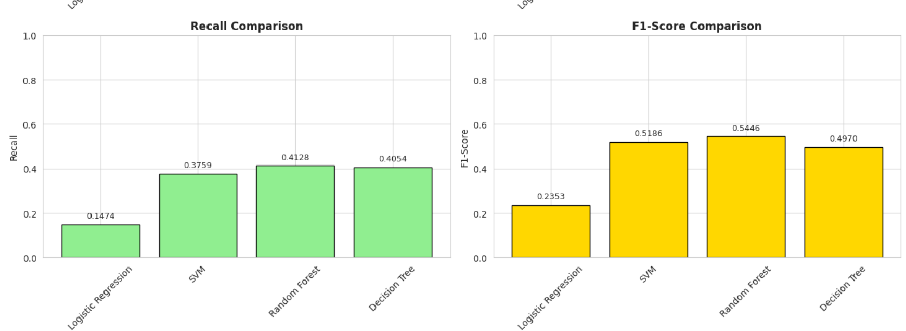
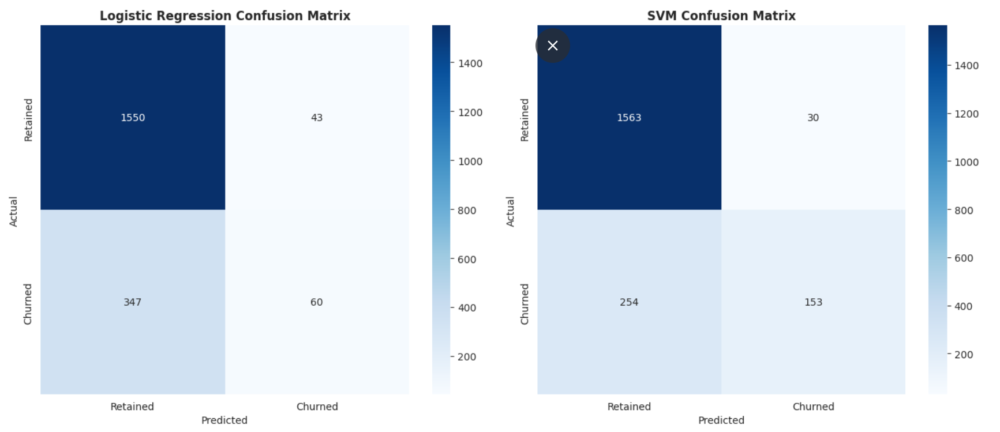
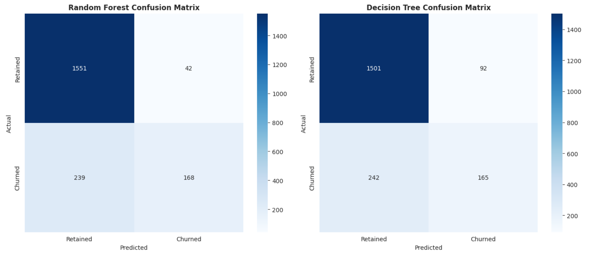
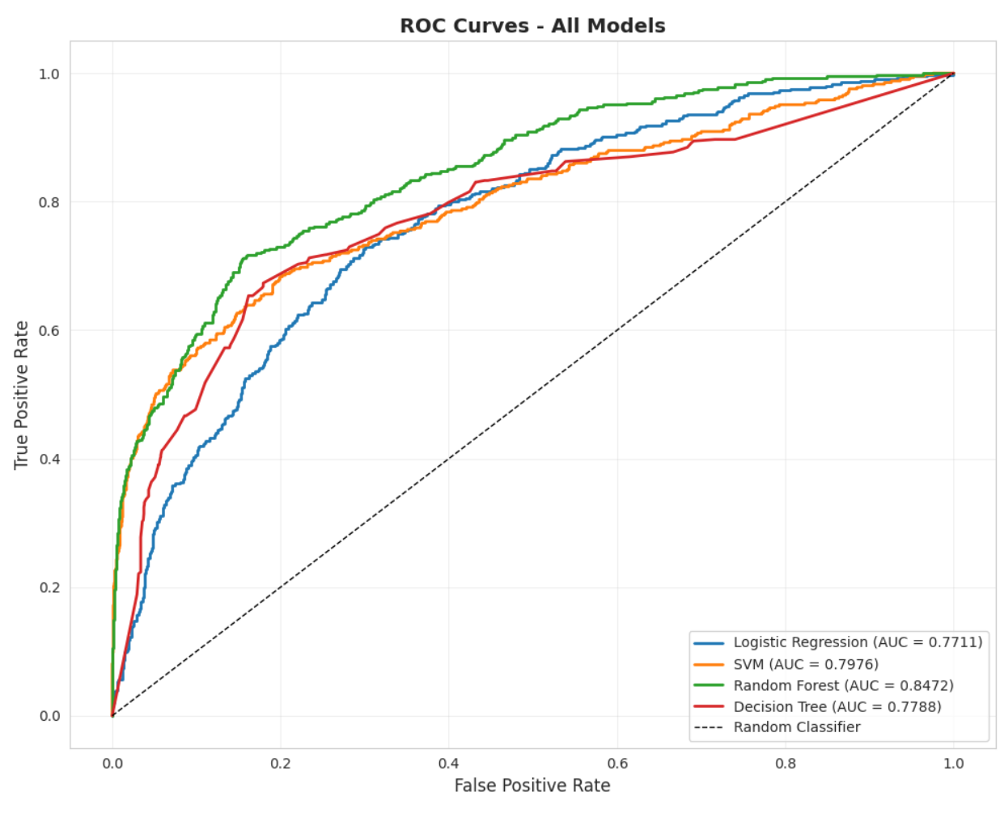
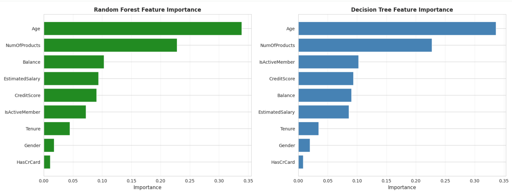
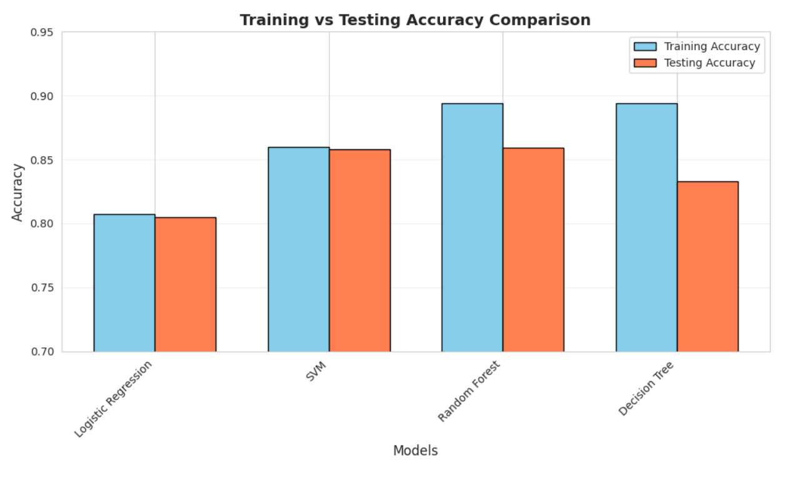
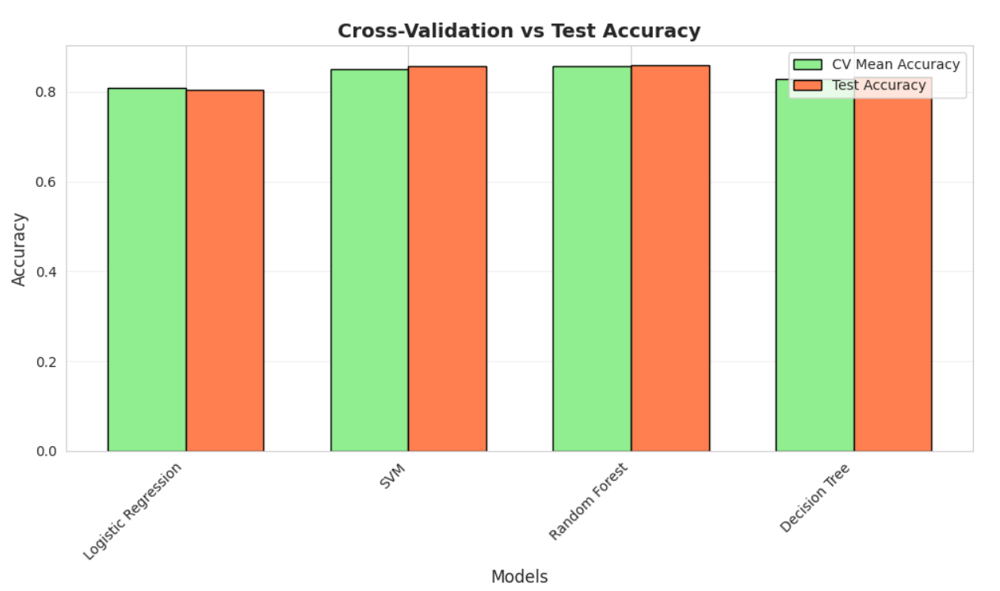

# Customer Churn Predictive Modeling

## What This Project Demonstrates

This project demonstrates an end-to-end machine learning workflow for predicting customer churn and selecting the classification model that provides the strongest overall performance.

Using a retail banking dataset containing 10,000 customer records, I built and evaluated four supervised machine learning models to determine which approach could best identify customers at risk of leaving the bank.

### Skills Demonstrated

* Exploratory Data Analysis (EDA)
* Data preprocessing and feature engineering
* Binary classification
* Logistic Regression
* Support Vector Machine (SVM)
* Random Forest
* Decision Tree
* Train-test splitting and feature scaling
* Cross-validation
* Model performance evaluation
* Precision, recall, F1-score, and ROC-AUC analysis
* Confusion matrix analysis
* Feature importance analysis
* Overfitting and generalization assessment
* Translating model results into business recommendations

### Tools & Technologies

`Python` `Pandas` `NumPy` `Scikit-learn` `Matplotlib` `Seaborn` `Google Colab`

---

## Business Problem

Customer churn can reduce recurring revenue and increase the cost of acquiring replacement customers. A retail bank wants to identify customers who are at greater risk of leaving so retention efforts can be targeted before those customers exit.

The dataset contains demographic, financial, and account activity information for 10,000 customers. The target variable, `Exited`, identifies whether a customer remained with the bank or churned.

Exploratory analysis identified an overall churn rate of 20.37%, meaning approximately one in five customers in the dataset had left the bank.

### Business Question

Can customer characteristics and account behavior be used to predict customer churn, and which classification model provides the best balance of predictive performance and generalization to unseen customers?

### Modeling Approach

Four classification algorithms were evaluated:

1. Logistic Regression
2. Support Vector Machine (SVM)
3. Random Forest
4. Decision Tree

Rather than selecting a model based only on accuracy, performance was evaluated across multiple measures including precision, recall, F1-score, ROC-AUC, cross-validation performance, and the difference between training and testing accuracy.

This approach provides a more complete assessment of whether a model can identify customers at risk while continuing to perform reliably on unseen data.

## Dataset Overview

The analysis uses a retail banking customer dataset containing 10,000 customer records and 13 original variables. The target variable is `Exited`, where `0` represents a customer who remained with the bank and `1` represents a customer who churned.

The dataset includes customer demographics, financial information, product relationships, and account activity that can be evaluated as potential predictors of churn.

### Key Dataset Characteristics

| Metric             |  Value |
| ------------------ | -----: |
| Customer Records   | 10,000 |
| Original Variables |     13 |
| Retained Customers |  7,963 |
| Churned Customers  |  2,037 |
| Churn Rate         | 20.37% |
| Missing Values     |      0 |

### Customer Churn Distribution

The target variable is imbalanced. Approximately 79.63% of customers remained with the bank, while 20.37% churned.

This imbalance is important when evaluating model performance. Accuracy alone could make a model appear effective even if it performs poorly at identifying customers who actually churn. For this reason, the models were also evaluated using precision, recall, F1-score, ROC-AUC, and confusion matrices.

### Predictive Features

| Feature           | Description                              |
| ----------------- | ---------------------------------------- |
| `CreditScore`     | Customer credit score                    |
| `Gender`          | Customer gender                          |
| `Age`             | Customer age                             |
| `Tenure`          | Length of customer relationship          |
| `Balance`         | Account balance                          |
| `NumOfProducts`   | Number of bank products used             |
| `HasCrCard`       | Whether the customer has a credit card   |
| `IsActiveMember`  | Whether the customer is an active member |
| `EstimatedSalary` | Estimated customer salary                |

Three identifier fields, `RowNumber`, `CustomerId`, and `Surname`, were removed before modeling because they were not used as predictive features.

After preprocessing, the modeling dataset contained nine predictor variables and the `Exited` target.

## Exploratory Data Analysis

Before training the classification models, I explored the relationships between customer characteristics and the `Exited` target variable.

A correlation matrix was used to identify linear relationships among the numerical features and provide an initial view of which variables may be associated with customer churn.

### Feature Correlation Matrix

### Initial Findings

The correlation analysis highlighted several relationships with customer churn:

| Feature            | Correlation with Churn |
| ------------------ | ---------------------: |
| Age                |                  0.285 |
| Balance            |                  0.119 |
| Estimated Salary   |                  0.012 |
| Has Credit Card    |                 -0.007 |
| Tenure             |                 -0.014 |
| Credit Score       |                 -0.027 |
| Number of Products |                 -0.048 |
| Gender             |                 -0.107 |
| Active Member      |                 -0.156 |

`Age` showed the strongest positive linear relationship with churn. Older customers in the dataset were more likely to be associated with the `Exited` class.

`IsActiveMember` showed the strongest negative relationship with churn, suggesting that active customers were less likely to leave the bank.

Account `Balance` also showed a positive relationship with churn, although the relationship was considerably weaker than age.

These correlations provide an initial view of customer behavior, but they do not establish causation or fully capture nonlinear relationships. For that reason, all nine predictive features were retained for the classification stage rather than selecting variables based only on correlation.

---

## Data Preparation

The dataset was prepared for machine learning before model training.

### Preprocessing Steps

1. Removed non-predictive identifier fields:

   * `RowNumber`
   * `CustomerId`
   * `Surname`

2. Encoded the categorical `Gender` variable into numerical format.

3. Separated the nine predictive features from the `Exited` target variable.

4. Split the dataset into:

   * 8,000 training records
   * 2,000 testing records

5. Used stratified sampling to preserve the approximately 20.37% churn rate across both datasets.

6. Standardized the predictive features using `StandardScaler`.

The scaler was fitted only on the training data and then applied to the testing data to prevent information from the test set from influencing model training.

### Modeling Pipeline

`Raw Customer Data` → `Data Cleaning` → `Feature Encoding` → `Train/Test Split` → `Feature Scaling` → `Model Training` → `Model Evaluation`

### Model Performance Comparison

## Model Development & Performance Comparison

Four supervised classification models were trained and evaluated to determine which approach provided the strongest performance for customer churn prediction.

### Models Evaluated

| Model                        | Purpose                                                                                  |
| ---------------------------- | ---------------------------------------------------------------------------------------- |
| Logistic Regression          | Established an interpretable baseline for binary classification                          |
| Support Vector Machine (SVM) | Modeled nonlinear decision boundaries using an RBF kernel                                |
| Random Forest                | Combined multiple decision trees to capture complex relationships and reduce overfitting |
| Decision Tree                | Provided an interpretable tree-based classification model                                |

Each model was evaluated on the same held-out test dataset to provide a consistent comparison.

### Performance Results

| Model               | Test Accuracy | Precision | Recall | F1-Score | ROC-AUC |
| ------------------- | ------------: | --------: | -----: | -------: | ------: |
| Logistic Regression |        80.50% |    58.25% | 14.74% |   0.2353 |  0.7711 |
| SVM                 |        85.80% |    83.61% | 37.59% |   0.5186 |  0.7976 |
| Random Forest       |        85.95% |    80.00% | 41.28% |   0.5446 |  0.8472 |
| Decision Tree       |        83.30% |    64.20% | 40.54% |   0.4970 |  0.7788 |

### What the Results Show

Random Forest achieved the highest overall testing accuracy at 85.95%, narrowly outperforming SVM at 85.80%.

SVM achieved the highest precision at 83.61%. This means that when SVM predicted that a customer would churn, it produced fewer false-positive churn predictions than the other models.

Random Forest achieved the highest recall at 41.28%, meaning it identified a larger share of the customers who actually churned.

Random Forest also produced the highest F1-score at 0.5446. Because F1-score balances precision and recall, this result was important when evaluating performance on the minority churn class.

### Why Accuracy Alone Was Not Enough

The dataset contains substantially more retained customers than churned customers. Because of this class imbalance, a model could achieve relatively high overall accuracy while still failing to identify many customers who actually churn.

Logistic Regression demonstrates this issue.

Although the model achieved 80.50% testing accuracy, its recall for churned customers was only 14.74%. In other words, overall accuracy did not provide a complete picture of the model's usefulness for the churn prediction problem.

For this reason, model selection considered multiple performance measures rather than relying on accuracy alone.

### Leading Model

Based on the initial performance comparison, Random Forest emerged as the strongest candidate:

* Testing Accuracy: 85.95%
* Precision: 80.00%
* Recall: 41.28%
* F1-Score: 0.5446
* ROC-AUC: 0.8472

Random Forest did not lead every individual metric, but it provided the strongest overall balance across the evaluation criteria.

## Classification Performance

Accuracy provides an overall measure of model performance, but for a churn prediction problem it is also important to understand what types of classification errors each model makes.

Confusion matrices were used to examine how effectively each model distinguished between retained and churned customers.

### Logistic Regression vs. Support Vector Machine

### Random Forest vs. Decision Tree

### Churn Classification Results

| Model               | Correctly Identified Churners | Missed Churners | False Churn Alerts |
| ------------------- | ----------------------------: | --------------: | -----------------: |
| Logistic Regression |                            60 |             347 |                 43 |
| SVM                 |                           153 |             254 |                 30 |
| Random Forest       |                           168 |             239 |                 42 |
| Decision Tree       |                           165 |             242 |                 92 |

### Business Interpretation

The confusion matrices highlight the tradeoff between precision and recall.

Logistic Regression missed 347 of the 407 customers who actually churned. This helps explain why its overall accuracy of 80.50% was misleading when considered by itself.

SVM produced only 30 false churn alerts, the lowest among the four models. This contributed to its leading precision score of 83.61%.

Random Forest correctly identified 168 churners, the highest number among the four models, while generating 42 false churn alerts. This resulted in the strongest recall and F1-score.

Decision Tree identified nearly as many churners as Random Forest but generated 92 false churn alerts, more than twice the number produced by Random Forest.

From a retention perspective, Random Forest provided the strongest balance. It identified the largest number of customers who actually churned without producing the higher level of false-positive predictions seen with the Decision Tree.

## ROC-AUC & Model Discrimination

To evaluate how well each model could distinguish between customers who churned and customers who remained with the bank, I compared their Receiver Operating Characteristic (ROC) curves and Area Under the Curve (AUC) scores.

### ROC Curve Comparison

### AUC-ROC Results

| Model               | AUC-ROC |
| ------------------- | ------: |
| Logistic Regression |  0.7711 |
| SVM                 |  0.7976 |
| Random Forest       |  0.8472 |
| Decision Tree       |  0.7788 |

### Key Finding

Random Forest achieved the highest AUC-ROC score at 0.8472, providing the strongest overall ability among the four models to distinguish between churned and retained customers.

SVM ranked second with an AUC-ROC of 0.7976, followed by Decision Tree at 0.7788 and Logistic Regression at 0.7711.

The ROC-AUC results provide further support for selecting Random Forest. Its advantage was not limited to classification accuracy. The model also demonstrated the strongest overall discrimination between the two customer outcomes.

Combined with its leading recall and F1-score, the AUC-ROC result strengthened the case for Random Forest as the best-performing model in this analysis.

## Feature Importance & Business Insights

After Random Forest emerged as the leading model, I examined feature importance to better understand which customer characteristics contributed most to its predictions.

### Tree-Based Feature Importance

### Random Forest Feature Importance

| Rank | Feature            | Importance |
| ---: | ------------------ | ---------: |
|    1 | Age                |     33.87% |
|    2 | Number of Products |     22.83% |
|    3 | Balance            |     10.29% |
|    4 | Estimated Salary   |      9.38% |
|    5 | Credit Score       |      9.06% |
|    6 | Active Member      |      7.22% |
|    7 | Tenure             |      4.46% |
|    8 | Gender             |      1.79% |
|    9 | Has Credit Card    |      1.10% |

### Key Findings

Age was the most influential feature in the Random Forest model, accounting for approximately 33.87% of total feature importance.

Number of Products ranked second at 22.83%. Together, these two variables represented approximately 57% of the model's total feature importance.

Balance, estimated salary, and credit score formed the next tier of predictive features.

Active membership also contributed to churn prediction, while tenure, gender, and credit card ownership had lower importance within the Random Forest model.

### From Model Output to Business Action

The feature importance results can help guide where a bank begins investigating customer retention.

For example:

* Customer age could be examined when developing churn-risk segments.
* Product relationships could be analyzed to determine whether certain product-use patterns are associated with higher churn risk.
* Account balance and activity could provide further context when prioritizing retention outreach.
* Customers identified as high risk by the model could be prioritized for targeted retention campaigns rather than applying the same strategy across the entire customer base.

Feature importance indicates how much the model relied on each variable when making predictions. It does not establish that a feature caused a customer to churn.

### An Interesting Modeling Insight

The exploratory correlation analysis and Random Forest results also demonstrate why predictive modeling can reveal relationships that simple correlation does not fully capture.

For example, `NumOfProducts` had only a weak linear correlation with churn during exploratory analysis, yet it became the second-most-important feature in the Random Forest model.

This suggests that its predictive value may involve nonlinear relationships or interactions with other customer characteristics that are not apparent from correlation alone.

## Model Generalization & Overfitting

Strong performance on training data does not guarantee that a machine learning model will perform well on new customers.

To evaluate model reliability, I compared training accuracy with testing accuracy and examined five-fold cross-validation performance.

### Training vs. Testing Performance

| Model               | Training Accuracy | Testing Accuracy |   Gap |
| ------------------- | ----------------: | ---------------: | ----: |
| Logistic Regression |            80.88% |           80.50% | 0.38% |
| SVM                 |            86.23% |           85.80% | 0.43% |
| Random Forest       |            89.38% |           85.95% | 3.43% |
| Decision Tree       |            89.41% |           83.30% | 6.11% |

Logistic Regression and SVM showed very small differences between training and testing accuracy.

Random Forest had a larger gap of 3.43 percentage points but remained below the 5-percentage-point threshold used in this analysis to flag potential overfitting.

Decision Tree showed the largest performance gap at 6.11 percentage points and was identified as the model with the clearest evidence of overfitting.

### Cross-Validation Analysis

Five-fold cross-validation was used to evaluate whether model performance remained consistent across different subsets of the training data.

| Model               | CV Mean Accuracy | Test Accuracy | Difference |
| ------------------- | ---------------: | ------------: | ---------: |
| Logistic Regression |           80.86% |        80.50% |      0.36% |
| SVM                 |           85.69% |        85.80% |      0.11% |
| Random Forest       |           85.71% |        85.95% |      0.24% |
| Decision Tree       |           82.84% |        83.30% |      0.46% |

### Generalization Findings

All four models produced cross-validation scores relatively close to their held-out test accuracy, indicating stable performance across different samples of the data.

Random Forest achieved a mean cross-validation accuracy of 85.71% compared with 85.95% on the test set, a difference of only 0.24 percentage points.

This result provides further evidence that Random Forest's performance was not dependent on a single favorable train-test split.

Decision Tree also produced similar cross-validation and testing results, but its larger training-to-testing performance gap indicated greater overfitting than the other models.

### Why This Matters

For a churn model to provide business value, it must perform reliably on customers it did not encounter during training.

The combination of strong test performance, consistent cross-validation results, and an acceptable training-to-testing gap strengthened the case for selecting Random Forest as the final model.
